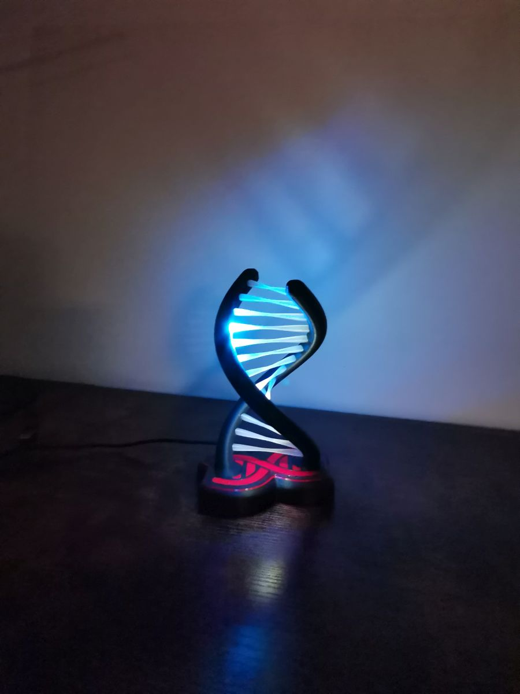

# 🕹️ Usage Instructions

This project includes four effect lists. The user can select and display a specific effect from one of the lists, or activate the **"Random"** mode in which effects change automatically every 7 seconds.

---

## 🔎 Visual Feedback

During user interaction, the LEDs provide visual feedback:

- **Changing the list** – display duration: **2 seconds**
  - Left helix shows the list number (**green**).
  - Right helix shows the number of effects in the list (**blue**).

- **Changing the effect** – display duration: **1.5 seconds**
  - Same as above, plus the right helix shows the selected effect number (with a **red dot**).

> *Note: While visual information is displayed, button actions are disabled.*

---

## 🔘 Button Actions

| Action             | Description                                                                 |
|--------------------|-----------------------------------------------------------------------------|
| Single click       | Switch to the next effect in the current list. Disables Random mode if active. |
| Double click       | Switch to the next effect list.                                             |
| Triple click       | Activate **Random mode** (effects auto-cycle every 7 seconds).              |
| Long press         | Save current list and effect to EEPROM, then enter **Sleep mode**.          |
| Single click (Sleep mode) | Wake up the lamp from Sleep mode.                                  |

---

## 🧾 Effect List Descriptions

### 🔷 Advanced Effects
1. **Pacifica** – Calm wave effect with smooth color transitions.  
2. **Pride** – Vibrant rainbow transitions.  
3. **Fire** – Realistic flame simulation.  
4. **Dot** – Single point animation moving along the helix.  
5. **Twinkle** – Gentle star-like sparkles.  

### 🌈 Color Palettes
1. **Rainbow** – Smooth spectrum color transitions.  
2. **Landscape** – Nature-inspired palette.  
3. **Gummy Bears** – Playful candy-like vibrant colors.  
4. **BHW3** – Elegant gradient palette.  
5. **Black Magenta Red** – Transition from dark tones to magenta and red.  
6. **Black Blue Magenta White** – Contrasting palette with cool and warm tones.  
7. **Sunset Real** – Realistic sunset colors.  
8. **Lava** – Intense, fiery lava-inspired colors.  
9. **GMT Dry Wet** – Transitions between dry and wet tones.  
10. **GR65 Hult** – Modern, designer-style gradient.  
11. **Departure** – Warm and cool high-vibrance tones.  
12. **Analogous** – Smooth transitions between adjacent colors.  

### 🔀 Mixed Effects
1. **Two Dots** – Two animated points moving in sync.  
2. **Fill And CC** – Fill effect combined with color transitions.  
3. **Bblinky Blink** – Fast, random blinking.  
4. **Spew Four** – Particle effects shooting in four directions.  
5. **Spew** – Center-origin particle dispersion.  
6. **Confetti GB** – Green and blue animated confetti.  
7. **Rainbow** – Moving rainbow gradient.  
8. **Applause** – Light bursts simulating applause.  
9. **Confetti** – Multicolor sparkle bursts.  
10. **Sinelon** – Moving dots with fading trail.  
11. **Juggle** – Multiple animated dots interacting.  

### 🎨 Solid Colors

| Color Name         | HSV Values           | Description                             |
|--------------------|----------------------|-----------------------------------------|
| Red                | HSV(0, 255, 192)     | Bright, intense red                     |
| Orange             | HSV(32, 255, 255)    | Warm and vibrant orange                 |
| Yellow             | HSV(64, 255, 255)    | Bright, sun-like yellow                 |
| Lime               | HSV(96, 255, 255)    | Energetic light green                   |
| Green              | HSV(138, 255, 255)   | Natural and vivid green                 |
| Aqua               | HSV(160, 255, 255)   | Cool, aquatic tone                      |
| Cyan               | HSV(180, 255, 255)   | Electric cyan-blue                      |
| Blue               | HSV(214, 255, 255)   | Deep, strong blue                       |
| White              | HSV(0, 0, 192)       | Pure white at moderate brightness       |

- **Modes:** Each solid color supports two modes: **Solid** and **Breathing** (fading effect).

---

## 💤 Sleep Mode

To conserve power or turn off the lamp:
- Long press to enter **Sleep mode**.
- Single press to wake it up.

---

